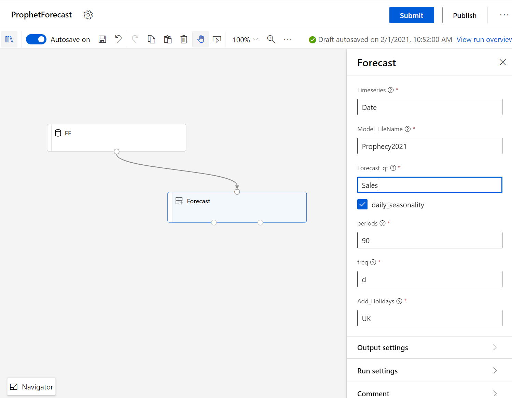
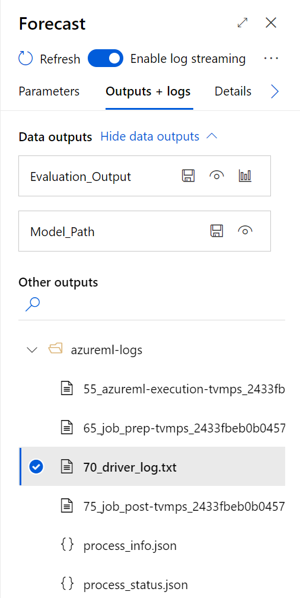
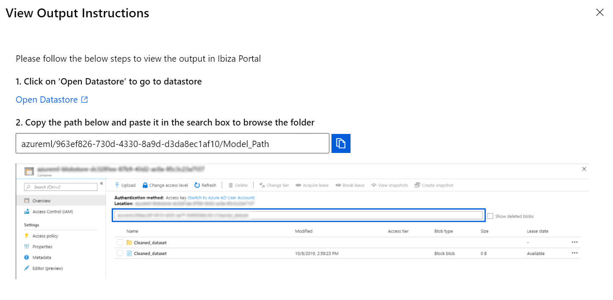
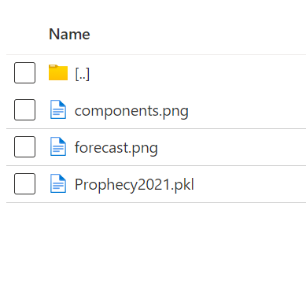
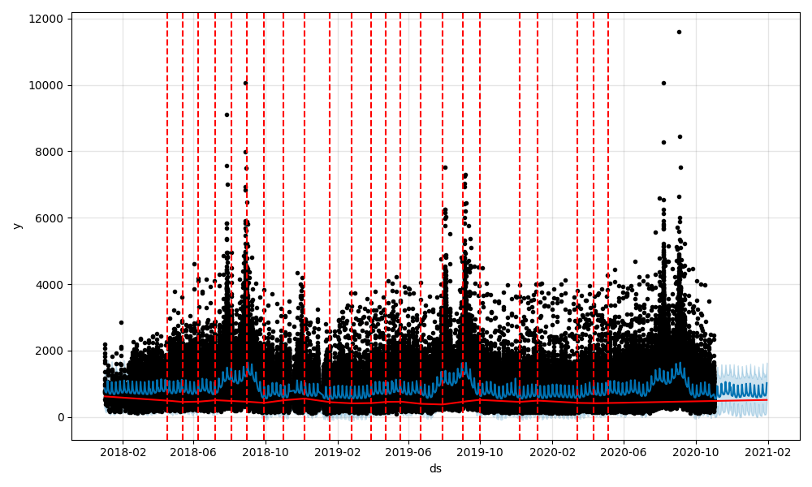
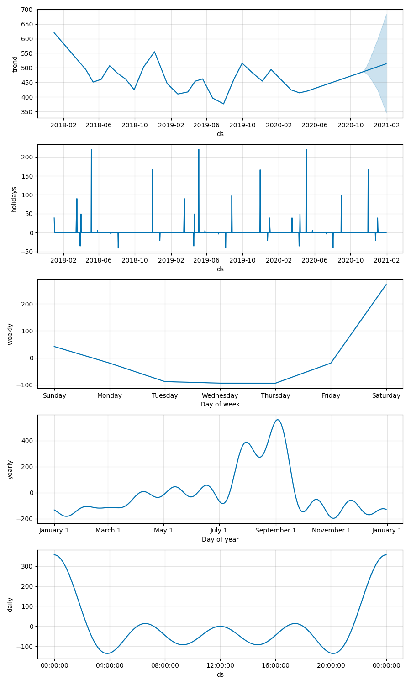

Basic Forecast with Prophet
=========================================
This component is to run a basic forecast with Prophet 

Requirements
-----------------------------
It requires a timeseries dataset with a timeseries column and a column of values to be forecast

Sample input Parameter selection
-----------------------------
In this example, we describe the input parameters

Sample outputs
-----------------------------

Sample Forecast Graphs
-----------------------------

