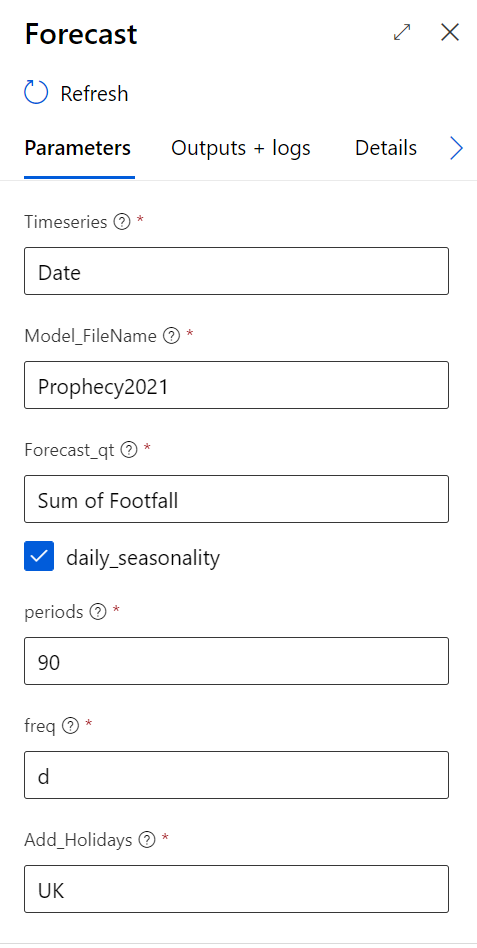
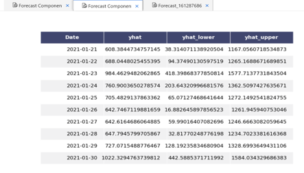
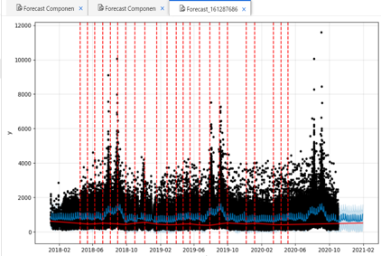
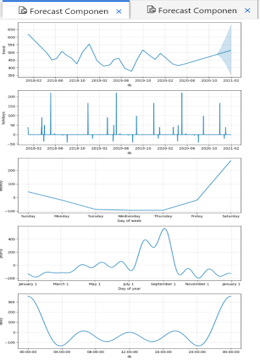
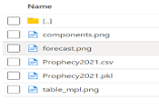

Basic Forecast with Prophet
=========================================
This component is to run a basic forecast with Prophet . Paper can be found : https://peerj.com/preprints/3190/

Requirements
-----------------------------
It requires a timeseries dataset with a timeseries column and a column of values to be forecast. A sample dataset is provided, example_yosemite_temps.csv.
Best results for daily data but accepts weekly or montly.

Sample input Parameter selection
-----------------------------
In this example, we describe the input parameters:
 
Timeseries : the column containing the timeseries
 
Model file name : the name the model will be output with
 
Forecast_qt ; quantity to be forecast ( i.e sales, foot fall etc...)
 
Periods: Forecast horizon (i.e 90 days, always specified in days)
 
Freq : the frequency of the data( 'd' for day, 'm' for month)
 
Add_holidays : ( add hoildays as per country code, ie UK - https://github.com/dr-prodigy/python-holidays)
 

Sample ouputs
-----------------------------
Forecast view from Designer as a table:

Forecast view from Designer as a Graph:

Forecast components view from Designer:

Forecast output to BLOB:

